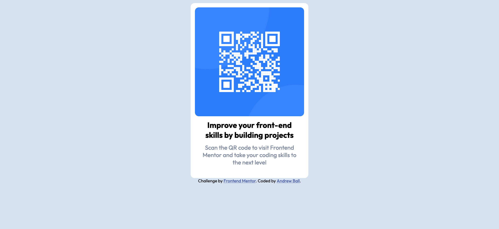

# Frontend Mentor - QR code component solution

This is a solution to the [QR code component challenge on Frontend Mentor](https://www.frontendmentor.io/challenges/qr-code-component-iux_sIO_H). Frontend Mentor challenges help you improve your coding skills by building realistic projects. 

## Table of contents

- [Overview](#overview)
  - [Screenshot](#screenshot)
  - [Links](#links)
- [My process](#my-process)
  - [Built with](#built-with)
  - [What I learned](#what-i-learned)
  - [Continued development](#continued-development)
  - [Useful resources](#useful-resources)
- [Author](#author)
- [Acknowledgments](#acknowledgments)

**Note: Delete this note and update the table of contents based on what sections you keep.**

## Overview

This is my first solo attempt at coding something without following a guided lesson. I've completed Dave Gray's HTML course but barely started on the CSS course so that part of the project might be barely passable after a lot of googling. I can already see how the HTML side of the project will be laid out and it will be interesting to see how I manage on the CSS side, looking forward to figuring out how to get the rounded corners on each of the blocks.

### Screenshot



### Links

- Solution URL: [Add solution URL here](https://your-solution-url.com)
- Live Site URL: [Add live site URL here](https://your-live-site-url.com)

## My process

### Built with

- Semantic HTML5 markup
- CSS custom properties
- Google font families
- Pure grit

### What I learned

Use this section to recap over some of your major learnings while working through this project. Writing these out and providing code samples of areas you want to highlight is a great way to reinforce your own knowledge.

Figuring out how to add in the Google fonts, at least for this project, was a pretty big win. Not only did I just have to copy and paste the code below into index.html:

```html
  <link rel="preconnect" href="https://fonts.googleapis.com">
  <link rel="preconnect" href="https://fonts.gstatic.com" crossorigin>
  <link href="https://fonts.googleapis.com/css2?family=Outfit:wght@100..900&display=swap" rel="stylesheet">
```

But I also figured out that rather than assigning it to a particular attribute, as Google suggested, I instead just made it the default for the whole page by adding it to the html selector, as seen below, saving myself quite a bit of extra code writing.

```css
html {
  background-color: hsl(212, 45%, 89%);
  font-family: 'Outfit', sans-serif; 
  font-style: normal;
}
```

I also tried to follow Google's style guide for writing out HTML/CSS and it was very interesting reading about exactly how many tags you could potentially omit. And having the spaces/indents being just 2 spaces rather than 4 really does make it look quite a bit neater.

### Continued development

I'm honestly still not sure how I got some of the elements to align. 

```css
figure {
  width: 300px; border-radius: 10px;
  margin: auto; padding: 0px 0px 20px;
  background-color: hsl(0, 0%, 100%);
  border: 1px solid hsl(0, 0%, 100%);
}
```
I'm not entirely sure why I had to add in a border the same colour as the background in order to get the QR code to move down in the figure box. I'll have to work through Dave's course and get a bit more familiar with CSS to figure out why.

Quite happy with how I managed on the HTML side, I just need to figure our more of the CSS side as no doubt I have gone around quite a convoluted way to get there. 

### Useful resources

- [MDN CSS Reference Sheet](https://developer.mozilla.org/en-US/docs/Web/CSS/Reference) - As the HTML equivalent had been very handy before, I spent a lot of time on this sheet trying to find the right properties to use in CSS.

## Author

- Website - [Andrew Ball](https://github.com/one-orb/)
- Frontend Mentor - [@yourusername](https://www.frontendmentor.io/profile/one-orb)

## Acknowledgments

The Internet
